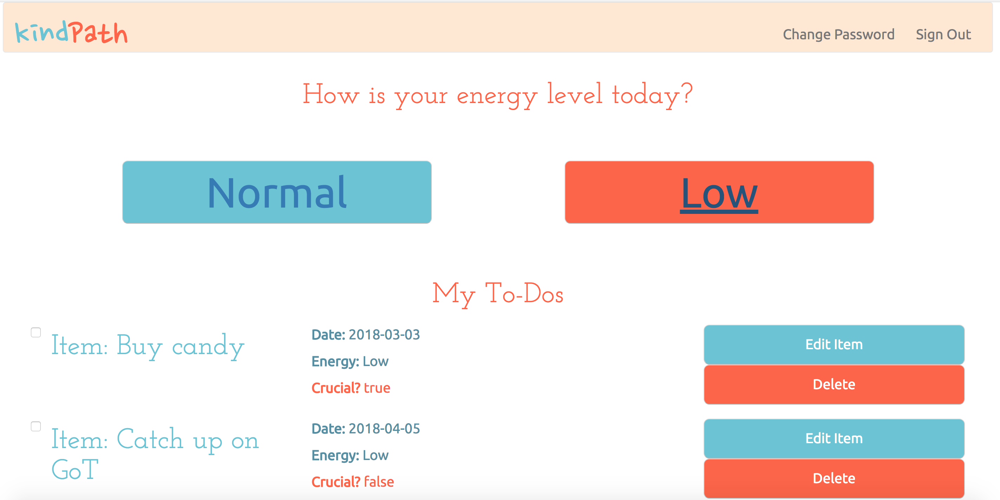

# kindPath

Every to-do list has a common feature: a strict push for the user to always complete the list, whether or not they
are physically or even mentally capable of completing the tasks on an equal day-to-day basis.  Enter kindPath, the
kinder to-do list app.  Just input the date and your energy level (choose between low and normal--upgrades to come
soon!) and kindPath will sort your to-do items based on an algorithm, showing only the most managable, or the most
crucial, tasks for you to complete.

**What it does:** Kindpath allows users to create, retrieve, update, and delete their to-do items.

**How it works:** Kindpath uses the Ember.js front-end framework to load components based on back-end
specifications and interface with resources stored in the Rails-based back end.

**Links:**
- [Back End API Repo](https://github.com/HTarzwell/kind-path-api)
- [Deployed Client](https://htarzwell.github.io/kindpath/)
- [Deployed API](https://damp-fjord-74106.herokuapp.com/)

## Development Tools

### Front End
- Ember.js
- Bootstrap
- Handlebars

### Back End
- Rails API

## Unsolved Problems (TBD)

## Planning

My first step was conceiving of a to-do list that not only took into account, but was built around, the
concept of a user having some days where they would be unable to complete anything but the most basic of
tasks.  My market research revealed that while there were some apps that filtered lists according
to the energy required, none had this as a central conceit and indeed were mainly built around punishing
users for "missed" items with pressing alerts and reductions in assets such as "karma", under the idea
that missing a to-do item was a personal failing.  As a result, I became deeply involved in planning the
application, but my plans proved to be overly ambitious, and I was obliged to scale back to achieve a
minimum viable product within the set time limit.

## Process

I first began by revisiting Rails, which had proved to be a useful and versatile framework for my app-building
needs.  There was never any question of my not using Rails; however, choosing the correct front-end structure
proved to be one of the most challenging parts of the process.  On instinct, I decided to go with vanilla JS at
first, but after some thought, I decided to return to my original instinct and run with the Ember.js framework;
our instructors made no bones about how difficult this process would be to learn, and how cumbersome Ember could
be as a framework, especially for beginners, but I felt that the rewards of using Ember would be worth the risk.

The first two days proved to be the most difficult in terms of challenges in building the application's bedrock.
However, once the application was served and operational, I worked closely with instructors to cement the basic
CRUD functions of the application, both of the 'auth' specifications and for the client resources.

I had reached MVP by Wednesday; however, the problem of how to actually make my application behave like a basic
to-do app still remained, and in this regard, Ember was to prove to be an obstacle at first.

## Problem-Solving

One of the hardest challenges in this process was learning how to correctly manage Ember components and routes,
in particular the DDAU system, where nested components and data were sent up and down.  I referred to in-class
documentation many times, and eventually discovered that the system, while counter-intuitive, could be made to
work well and create a foundation of granular components that could be easily adapted to my needs.

However,

## App Screenshot

## Wireframes

## User Stories

SUPER-EPIC
- As a user, I want an app that will be responsive to my energy levels and allow me to automatically rearrange my to-do list in accordance with my # of spoons/amount of energy in a given day
EPIC
- As a user, I want to be able to schedule instances of to-dos based on the day
- As a user, I want to be able to set my energy levels
- As a user, I want to be able to set the urgency of my to-dos
- As a user, I want to be able to set a critical property on a to-do to prevent rescheduling
- As a user, I want to be able to select my energy level
NORMAL
- As a user, I want to be able to CRUD an account
- As a user, I want to be able to CRUD resources
- As a user, I want to be able to select from a list of pre-existing resources and have them applied to my created resources
- As a user, I want to be able to sort my resource data in accordance to pre-existing parameters (energy levels and urgency)
